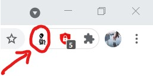

# What does this extension do?  

When you click the extension button the URL you are currently at will be parsed. If you have a corresponding JS file in the root/scripts/ folder it will immediately run.  

Button Location
 

 

# Why do I want it?   

Write yourself a suite of simple (or complex) scripts to make your life easier. 

Automate repetitive web based tasks, parse document data, download images.... Whatever you like. Don't worry about keeping track of your scripts, or entering them into the console. Just click a button!
 
 

# Loading this extension into Chrome:  

1. Clone the repository 
    - git clone https://github.com/TravisHunting/Chrome-Domain-Specific-JS-Injector.git
2. Open Chrome, then open the menu (3 dots in the top right corner) 
3. Click "More Tools" -> "Extensions"
    - Make sure to enable "Developer mode" with the slide button in the top right corner of the window
5. Click "Load Unpacked Extension" near the top left corner of the window
6. Navigate to the root folder of the extension 
    - In this case, "Chrome-Domain-Specific-JS-Injector"
7. Hit "Select Folder" to finalize.

 

# Notes:  

- If you attempt to run the extension on a site for which a script does not yet exist, you will be notified. If you open the Chrome Developer Tools by pressing F12, you can see exactly what you will need to name the script file in order for it to be run automatically.
- The "Extension Button" is found in the top right corner of the Chrome window. If the button is not visible at first, you may need to click on the small icon that looks like a puzzle piece, then click the 'Pin' icon next to this extension (Javascript Injector).

